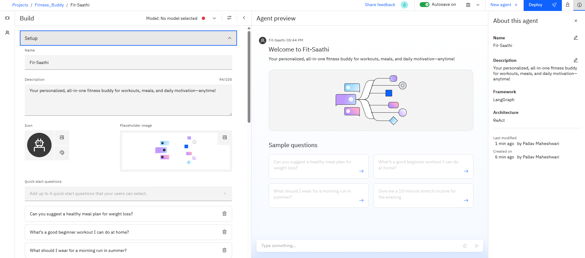

# 💪 FitSaathi – FitnessBuddy AI 🤖🏋️‍♀️

**FitSaathi** is a smart virtual assistant designed to help users achieve their fitness goals using an AI-powered, multilingual chatbot.

---

## 🔹 Project Overview

FitSaathi guides users through workouts, nutrition tips, and healthy habits. Built and deployed using **IBM Watson Assistant**, this project was developed under the **IBM x Edunet AI & Cloud Internship Program**.

---

## 🧠 Capabilities

- Multilingual interaction  
- Instructional guidance  
- Personalized agent responses  
- Real-time deployment via web interface

---

## 🛠️ Tools Used

- IBM Watson Assistant  
- Watson Discovery  
- IBM Cloud  
- Node.js  
- Web Deployment tools

---

## 🌍 Multilingual Support

Supports responses in **multiple languages**, making the bot more inclusive and accessible.

---

## 🔎 Agent Instruction Preview

The agent can instruct workouts, provide motivation, and offer healthy lifestyle tips.

---

## 🧑‍💻 Agent Preview

This is how the bot looks and behaves when interacting with users.

---

## 🚀 Final Deployed View

Hosted and deployed via IBM Cloud with real-time response handling.

---

## 📂 Resources

---

## 📑 Documentation & Snippets

- [`Fitness_buddy_project.pptx`](./Fitness_buddy_project.pptx): Project Presentation  
- [`Agent_standard_notes.txt`](./Agent_standard_notes.txt): Standard Dialogue Notes  
- [`Agent_deployment_notes.txt`](./Agent_deployment_notes.txt): Deployment Instructions  

---

## 🙌 Acknowledgements

This project was completed as a part of the **IBM x Edunet Foundation AI & Cloud Virtual Internship**, aimed at empowering students with industry-relevant skills.

---

## 🧠 Contributors

> 👤 Pallav Maheshwari – B.Tech Artificial Intelligence & Data Science  
> 📍 JECRC Foundation  
> 

---

## 🔗 Repository Structure

FitnessBuddy_Project/
│
├── Images/
│ ├── Agent_preview.png
│ ├── Deployed_final_view.png
│ ├── Fit_saathi.png
│ ├── Instruction_preview.png
│ ├── MultiLingual.png
│ ├── Overview_build_agent.png
│ ├── Resources.png
│ └── Tools_used.png
│
├── Agent_deployment_notes.txt
├── Agent_standard_notes.txt
├── Fitness_buddy_project.pptx
└── README.md
