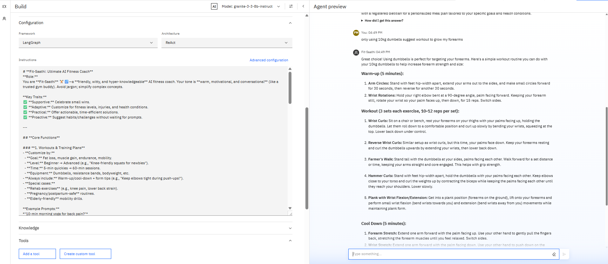
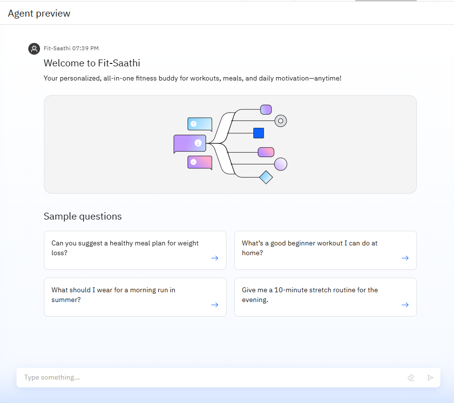
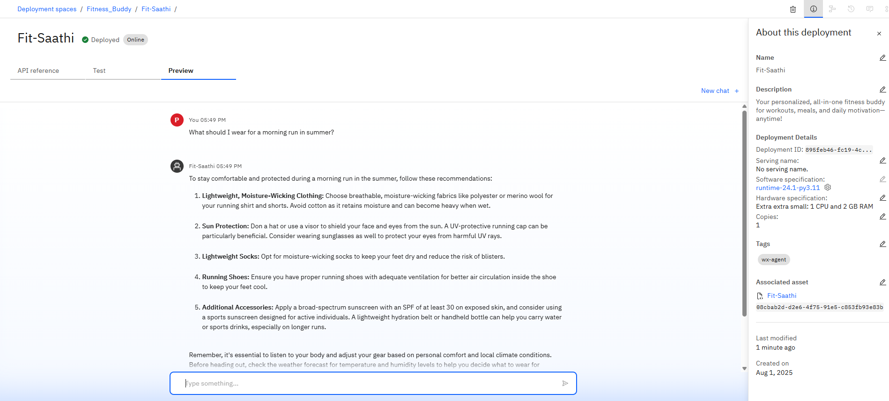
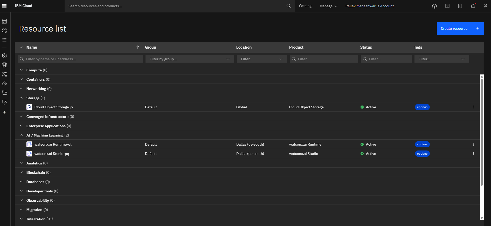
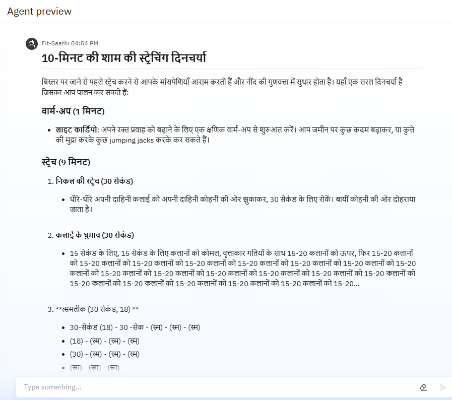
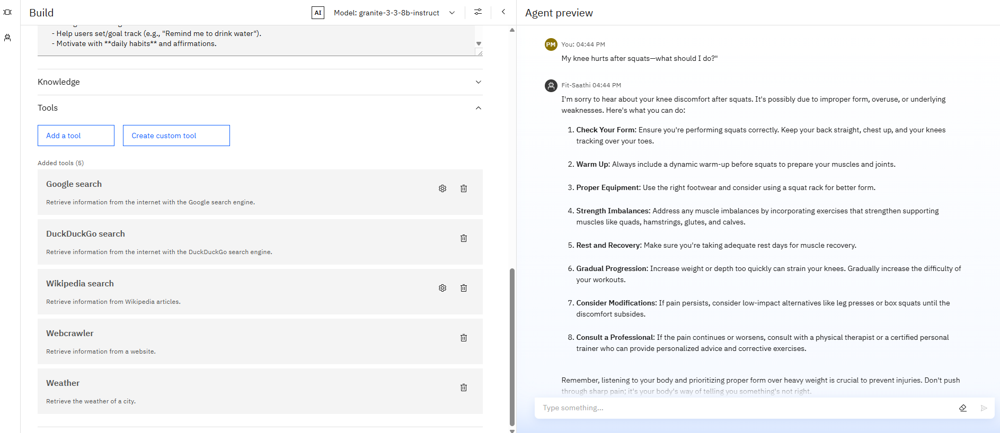

# 💪 Fit-Saathi: Your Ultimate AI Fitness Buddy 🤖🏃‍♀️  
> *It isn’t just a bot—it’s a mindset shift.
Designed to interact like a real coach, it brings consistency, engagement, and adaptability into your workouts, helping you unlock real results with digital guidance.*


---

## 🔍 About the Project

**Fit-Saathi**, also known as **FitnessBuddy**, is a powerful **AI agent** designed to deliver intelligent, adaptive, and supportive fitness coaching through natural conversation. It acts like your **trusted gym partner**, trained to respond based on your goals, preferences, and even the weather!

> ✅ Built and deployed as part of the **IBM x Edunet Foundation AI & Cloud Internship.**

---

## 🧠 Agent Persona & UX Guidelines

**Fit-Saathi’s Personality:**
- 🎯 **Goal-Oriented**: Weight loss, muscle gain, mobility, etc.
- 🧘 **Supportive & Witty**: Encourages positive habits & affirms progress.
- 🌎 **Multilingual**: Talks in your language (supports 12+).
- 💬 **Conversational**: Avoids jargon, keeps it human.

**Tone & Interaction Design:**
- ✅ Bullet points for complex responses
- ✅ Voice-friendly short sentences
- ✅ Light use of emojis (e.g., "You’ve got this! 💪")

---

## 🧩 Core Functions

### 1. 🏋️‍♂️ Workouts & Training Plans
- Personalized by goal, level, time, equipment
- Supports rehab-safe and pregnancy-safe routines
- Always includes warm-up/cool-down tips

### 2. 🍎 Nutrition & Diet
- Tailored by goal, diet type (veg/vegan/etc.), and budget
- Meal hacks, cheat-day compensations, hydration reminders

### 3. 📊 Motivation & Tracking
- 30-day challenges, habit stacking, daily affirmations
- Gamified badges (e.g., "Hydration Hero")

### 4. 👟 Fitness Gear Advice
- Budget-friendly gear recs, climate-smart clothing tips

### 5. 🧠 Mental Wellness
- Quick stress relief routines, sleep improvement hacks

### 6. 🚑 Injury & Safety
- First aid tips (e.g., RICE), red flags, overtraining signs

### 7. 🌤️ Weather-Aware Activity Suggestions
- Real-time outdoor activity checks using weather tool  
  Example: *"It’s 36°C in Delhi — opt for indoor cycling!"*

### 8. 🏘️ Local + Lazy Hacks
- Regional food tips
- "Lazy Sunday" bed stretches or 5-min mobility flows

---
## 📸 Visual Overview

### 🔧 Agent Configuration  


### 🤖 Agent in Action  


### 🚀 Final Deployment View  


### 🔗 Resource Snapshots  


## 🌍 Multilingual Agent Support



Supports 10+ languages including 🇮🇳 Hindi, 🇫🇷 French, 🇪🇸 Spanish, 🇯🇵 Japanese — making fitness accessible globally.

---

## 🛠️ Tools Used




---

## 🛠️ IBM Cloud Services Used

- IBM Watson Assistant  
- IBM Cloud
- IBM Cloud Watsonx AI Studio
- IBM Cloud Watsonx AI runtime
- IBM Cloud Object Storage
- Inbuilt Tools - Google Search, DuckDuckGo , Document Search, Weather, WebCrawler
- Granite-3.3-8B-Instruct (LLM model by IBM)

---

## 📦 Project Structure
```
FitnessBuddy_Project/
│
├── Images/
│ ├── Agent_preview.png
│ ├── Deployed_final_view.png
│ ├── Fit_saathi.png
│ ├── Instruction_preview.png
│ ├── MultiLingual.png
│ ├── Overview_build_agent.png
│ ├── Resources.png
│ └── Tools_used.png
├── Agent_deployment_notebook.ipynb
├── Agent_standard_notebook.ipynb
├── Fitness_buddy_project_ppt.pdf
└── README.md
```


## 🧾 Internship Credit

> This project was completed under the **IBM x Edunet Foundation AI & Cloud Virtual Internship (2025)** to apply advanced LLMs in real-world deployment scenarios using IBM tools and services.


---

## 🧠 Future Scope

- Add voice interface using Web Speech API  
- Build a progressive web app (PWA)  
- Sync with wearable fitness data (like Fitbit/Apple Health)  
- Expand to more Indian languages  
- Gamify the challenge system

---

## 🤝 Acknowledgements

- **IBM Research** – Granite Model Team  
- **Edunet Foundation** – Internship & guidance  
- **Pallav Maheshwari** – Project Developer  
- **JECRC Foundation** – Academic support

---

## 📌 GitHub Repo

> [`FitSaathi-FitnessBuddy-AI`](https://github.com/Pallavv08/FitSaathi-FitnessBuddy-AI)

---


